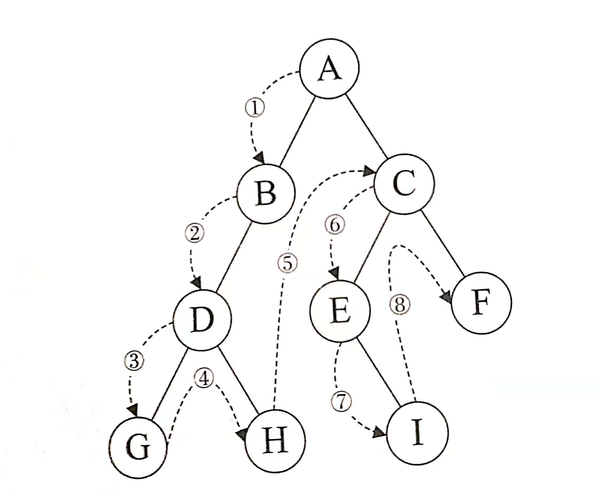
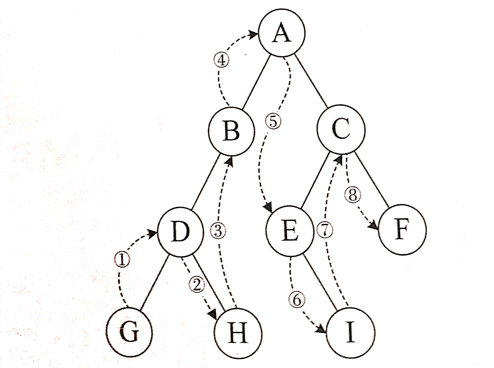
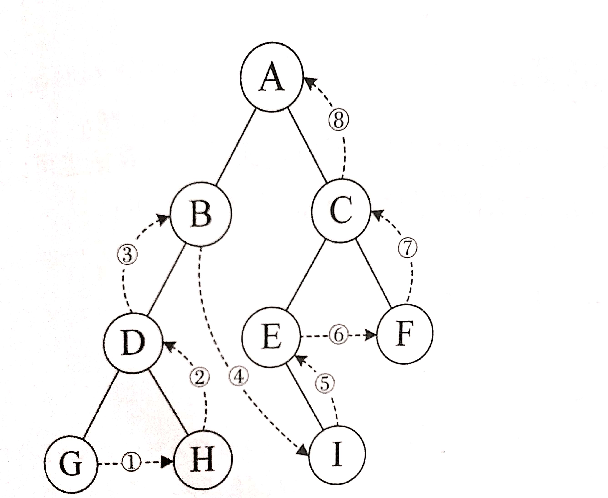

# 算法题总结

## 题目分析

### 第一题

#### 分析

1. 利用map的特性，把元素最为键放到map中，把索引作为值，利用count函数找出现的次数，对于map而言，不是1就是0；为1表示找到，就比较索引差是否小于k；是就返回true。

2. 此外还可以利用双层for循环去做，只是时间复杂度比较高。

#### 代码

```c++
bool ContainsNearbyDuplicate(vector<int>& nums,int k)
{
	map<int, int>m;
	for (int i = 0; i < nums.size(); i++)
	{
		if (m.count(nums[i]))
		{
			if (abs(m.at(nums[i]) - i) <= k)
				return true;
		}
		else
			m.insert(pair<int, int>(nums[i], i));
	}
	return false;
```

### 第二题

#### 分析

这题主要想表达的就是二十六进制。

把输入的数字对十取余，字符’A‘和余数相加，但要注意等于1才是'A'，二十六或者26的倍数时应该是字符Z，也就是说26进制是0-25，所以要把数字n减去1。

#### 代码

```c++
//最初版
char * ExcelSheetColumnTitle(int n)
{
	char vaule[MAX_LEN] = { '\0' };
	if (n <= 0)return vaule;
	int i = 0;
	int tag = 0;
	while (n)
	{
		--n;
		vaule[i] = (char)('A' + n % 26);
		n /= 26;
		i++;
	}
	i--;
	char vaules[MAX_LEN] = { '\0' };
	vaules[0] = '"';
	for (int j = 0; j <= i; j++)
	{
		vaules[i - j + 1] = vaule[j];
	}
	vaules[strlen(vaules)] = '"';
	return vaules;
}

//改进版
string ExcelSheetColumnTitle(int n)
{
	string ret = "";
	if (n <= 0)
		return ret;
	while (n)
	{
		--n;
		ret.insert(ret.begin(), 'A' + n % 26);
		n /= 26;
	}
	return ret;
}
```

### 第三题

#### 分析

丑数就是只能被2，3，5整除的数，理解过来就是可以先把一个数先用2去除，除到不能整除时就换成数字3去整除，然后换数字五，除到最后商为1时就是丑数。

- 注意：数字1也是丑数，单独考虑。

#### 代码

```c++
bool IsUgly(int num)
{
	if (num == 0) return false;
	if (num == 1)return true;
	int i = 2;
	while (num % i == 0)num /= i;
	i = 3;
	while (num % i == 0)num /= i;
	i = 5;
	while (num % i == 0)num /= i;
	return num == 1;
}
```

### 第四题

#### 分析

回文数例如121等，不能转成字符串，采用对10取余的方式，取出一位数就把依次乘10放到高位上，最后比较两个数字是否相同，相同就返回true。

- 注意：在乘10往高位放的时候，为了避免数据越界，把运算的中间变量定义为long long型。

#### 代码

```c++
bool  IsPalindrome(int x)
{
	if (x < 0)return false;
	if (x == 0)return true;
	long long x1 = 0;
	int x2 = x;
	while (x2)
	{
		x1 = x1 * 10 + x2 % 10;
		x2 /= 10;
	}
	return x1 == x;
}
```

### 第五题

#### 分析

涉及到了数据结构二叉树，考察对二叉树的遍历和二叉树的创建。

还用到了递归的思想。

- 二叉树的创建和解释参考知识点总结。

推荐使用层序，最小深度遇到叶子节点直接返回，不用再往下递归。

#### 代码 

##### 递归

###### 前序

```c
#defien MIN(a,b) (a < b ? a : b)
int MinDepth(struct TreeNode* root)
{
    if(root == NULL)
        return 0;
    int min_depth = INT_MAX;
    if(root->lift == NULL&&root->right == NULL)
        return 1;
    if(root->lift != NULL)
       return MIN(MinDepth(root->lift)+1,min_depth);
    if(root->right != NULL)
      return MIN(MinDepth(root->right)+1,min_depth);
}
```

###### 后序

```c
#define MIN(a,b)  (a < b ? a : b) 
int MinDepth(struct TreeNode* root)
{
    if(root == NULL)
        return 0;
    int lift = MinDepth(root->lift)
    int right = MinDepth(root->right)
    if(lift != 0&&right == 0)
        return lift + 1;
    if(lift == 0&&right != 0)
        return right + 1;
    if(lift == 0&&right == 0)
        return 1;
    return MIN(lift,right) + 1;
}
```

##### 队列（层序）

```c
int MinDepth(struct TreeNode* root)
{
	if (root == NULL)
		return 0;
	queue<pair<TreeNode*, int>>my_queue;
	my_queue.push({ root, 1 });
	int min_depth = 1;
	while (!my_queue.empty())
	{
		min_depth = my_queue.front().second;
		root = my_queue.front().first;
		my_queue.pop();
		if (root->left == NULL&&root->right == NULL)
			return min_depth;
		if (root->left != NULL)
			my_queue.push({ root->left, min_depth + 1 });
		if (root->right != NULL)
			my_queue.push({ root->right, min_depth + 1 });
	}
	return min_depth;
}
```

### 第六题

#### 分析

这题和第一题有点类似，只不过第一题需要对索引进行判断，采用map以键值对的形式存放比较方便，这题可以采用set容器，只需要把元素放到set容器中，如果遇到重复count函数为1则找到了该元素，返回true。

#### 代码

```c
bool ContainsDuplicate(vector<int>& nums)
{
	if (nums.size() == 0)
        return false;
	set<int>my_set;
	for (int i = 0; i < nums.size(); i++)
	{
		if (my_set.count(nums[i]))
			return true;
		else
			my_set.insert(nums[i]);
	}
	return false;
}
```

### 第七题

#### 分析

求最大深度，采用递归的方法，到一层节点加1，和第五题求最小深度类似。但有点区别，同样采用两种办法求解即递归和队列。

#### 代码

##### 递归

###### 前序

```c
#define MAX(a,b) (a > b ? a : b)
int MaxDepth(TreeNode* root)
{
    if(root == NULL)
        return 0;
    if(root->lift NULL&&root->right == NULL)
        return 1;
    int lmax = 0;
    int rmax = 0;
    if(root->lift != NULL)
        lmax = MAX(MaxDepth(root->lift),lmax);
    if(root->right != NULL)
        rmax = MAX(MaxDepth(root->right),rmax);
    return MAX(lmax,rmax);
}
```

###### 后序

```c
#define MAX(a,b) (a > b ? a : b)
int MaxDepth(TreeNode* root)
{
	if (root == NULL)
		return 0;
	int lift = MaxDepth(root->left);
	int right = MaxDepth(root->right);
	if (right == 0 && lift == 0)
		return 1;
	return MAX(lift, right) + 1;
}
```

##### 队列（层序）

```c
#define MAX(a,b) (a > b ? a : b)
int MaxDepth(TreeNode* root)
{
	if (root == NULL)
		return 0;
	queue<pair<TreeNode*, int>>my_queue;
	int max = 0;
	my_queue.push({ root, 1 });
	while (!my_queue.empty())
	{
		root = my_queue.front().first;
		max = MAX(my_queue.front().second,max);
		my_queue.pop();
		if (root->left != NULL)
			my_queue.push({ root->left, max + 1 });
		if (root->right != NULL)
			my_queue.push({ root->right, max + 1 });
	}
	return max;
}
```

### 第八题

#### 分析

方法一：把给定的数对2取余再除2直到为0为止。

方法三：[分治法][https://blog.yuccn.net/archives/469.html]

#### 代码

##### 取余

```c
int HammingWeight(uint32_t n)
{
	if (n == 0)return 0;
	int times = 0;
	while (n)
	{
		if (n % 2 == 1)
			times++;
		n = n / 2;
	}
	return times;
}
```

##### 分治法

```c
int HammingWeight(uint32_t n)
{
	n = (n & 0x55555555) + ((n >> 1) & 0x55555555);
	n = (n & 0x33333333) + ((n >> 2) & 0x33333333);
	n = (n & 0x0f0f0f0f) + ((n >> 4) & 0x0f0f0f0f);
	n = (n & 0x00ff00ff) + ((n >> 8) & 0x00ff00ff);
	n = (n & 0x0000ffff) + ((n >> 16) & 0x0000ffff);
	return n;
}
```

### 第九题

#### 分析

分别对两个字符串进行长度的判断，然后从低位开始一位一位取相加，期间注意进位，加采用异或运算，看是否有余数用与运算。结束后看进位是否为1，是就增加数组长度把1放到字符数组索引为0的位上。

#### 代码

```c
char * AddBinary(char * a, char * b)
{
	int lena = strlen(a);
	int lenb = strlen(b);
	if ((lena > 10000) || (lena < 1))return "0";
	if ((lenb > 10000) || (lenb < 1))return "0";
	
	int maxlen = lena >= lenb ? lena : lenb;
	int i, tempa, tempb, carry = 0;
	char *value = (char *)calloc(maxlen + 2, 1);//+2是\0和进位
	
	while (lena>0 || lenb>0)
	{
		tempa = (lena--)>0 ? a[lena] - '0' : 0;//从低位开始计算
		tempb = (lenb--)>0 ? b[lenb] - '0' : 0;
		value[maxlen--] = ((tempa^tempb) ^ carry) + '0';
		carry = (tempa&tempb) | ((tempa^tempb)&carry);//判断是否需要进位
	}
	if (carry == 1)//看最后一次加后有无进位
		value[0] = '1';
	else 
		strcpy(value, value + 1);
	return value;
}
```

```c
//c++版本
string AddBinary(string a, string b)
{
	if (a.size() == 0 && b.size() == 0)
		return NULL;
	string value = "";
	int lena = a.size();
	int lenb = b.size();
	int maxlen = lena > lenb ? lena : lenb;
	int timea,timeb,carry;
	timeb = timeb = carry = 0;
	while (maxlen--)
	{
		timea = lena-- > 0 ? a[lena] - '0' : 0;
		timeb = lenb-- > 0 ? b[lenb] - '0' : 0;
		value.insert(value.begin(),((timea ^ timeb ^ carry) + '0'));
		carry = (timea & timeb) | ((timea^timeb)&carry);
	}
	if (carry)
		value.insert(value.begin(), '1');
	return value;
}
```


### 第十题

#### 分析

第十题依旧考察的是对二叉树的遍历，采用的是递归的办法，当然还有队列的办法。递归采用前序遍历，也便于理解，找到一个节点就记录一个节点的路径，采用一个缓冲数组，找到就放到数组中，直到找到叶子结点就放到要返回的二维数组中

队列的办法就是采用两个队列，一个存放节点，一个存放路径。

#### 代码

##### 递归（前序）

其中用到了sprintf()函数和strcpy()函数，前者返回值为当前字符串的长度，其作用把每个值或者字符串输出到一个数组或变量中，后者则是把一个字符串拷贝到另外一个数组中。

```c
void dfs(char **ret, char *buffer, int index, int *returnSize, TreeNode* root)
{
	index += sprintf(buffer+index, "%d->", root->val);
	if (root->left == NULL&&root->right == NULL)
	{
		ret[*returnSize] = (char*)calloc(index - 1, sizeof(char));
		buffer[index - 2] = '\0';
		strcpy(ret[*returnSize], buffer);
		*returnSize = *returnSize + 1;
		return;
	}
	if (root->left != NULL)
		dfs(ret, buffer, index, returnSize, root->left);
	if (root->right != NULL)
		dfs(ret, buffer, index, returnSize, root->right);
}

char ** BinaryTreePaths(struct TreeNode* root, int* returnSize)
{
	char **ret = (char **)malloc(100*sizeof(TreeNode*));
	char buffer[1024] = {};
	int index = 0;
	dfs(ret, buffer, index, returnSize,root);
	return ret;
}
```

### 第十一题

#### 分析

此题考察对规律的发现，而且对题目要求理解，每一步都是最优解，所以这题经过尝试不难发现只有4个石头或为4的倍数的时候我们不能赢。所以对4取余即可。

#### 代码

```c
bool CanWinNim(int n)
{
    if(n % 4 == 0)
        return false;
    return true;
}
```

### 第十二题

#### 分析

这题最重要的就是要发现最先发现的左括号是最后判断的，只有最后发现的才是最先判断的，侧面理解就是考察栈用法的考察即先进后出，后进先出。这样就可以先找左括号，找到就把对应的右括号放到栈中，这样是便于消去之后发现的右括号。发现右括号就把栈中的右括号出栈。最后看栈是否为空为空true。

#### 代码

```c
bool IsValid(string s)
{
	if (s.size() == 0)
		return false;
	stack<char>my_stack;
	for (int i = 0; i < s.size(); i++)
	{
		if (s[i] == '(')
			my_stack.push(')');
		else if (s[i] == '{')
			my_stack.push('}');
		else if (s[i] == '[')
			my_stack.push(']');
		else if (my_stack.empty() || s[i] != my_stack.top())
			return false;
		else
			my_stack.pop();
	}
	return !my_stack.empty();
}
```

### 第十三题

#### 分析

这题思路大致是先看有无空格，然后看有无正负号，然后看是否为0到9组成的数字，期间出现别的直接返回，最后最重要的就是越界的判断，这里采用的是对每次取出一位数后与最大值和最小值除10进行判断大于越界。**注意**：等于的情况，要看个位是否大于7或8。

#### 代码

```c
int MyAtoi(char * s)
{
	int len = strlen(s);
	if (len == 0)return 0;
	int f = 1;
	while (*s == ' ')
		s++;
	switch (*s)
	{
		case '-':{f = -1; s++; break; }
		case '+':{s++; break; }
	}
	if ((*s - '0' < 0) || (*s - '0' > 9))
		return 0;
	int ret = 0;
	while ((*s - '0' >= 0) && (*s - '0' <= 9))
	{
		if ((ret > INT_MAX / 10 || (ret == INT_MAX / 10 && (*s - '0') > 7))&&f == 1)
			return INT_MAX;
		if ((ret < INT_MIN / 10 || (ret == INT_MIN / 10 && (*s - '0') > 8))&&f == -1)
			return INT_MIN;
		ret = ret * 10 + (*s - '0') * f;
		s++;
	}
	return ret;
}
```

### 第十四题

#### 分析

方法一：该办法就是异或法即相同的异或得0；0和谁异或得到自己本身，对于这题特别适用。

方法二：利用一个容器set，发现重复的直接从set容器中删除，没发现就不相同就插入容器中。

#### 代码

方法一 异或

```c
int SingleNumber(int* nums, int numsSize)
{
	if (nums == NULL)return 0;
	int a = nums[0];
	if (numsSize > 0)
		for (int i = 1; i < numsSize; i++)
			a = a^nums[i];
	return a;
}
```

方法二 set容器

```c
int SingleNumber(vector<int>& nums)
{
    set<int>my_set;
    for(int i = 0;i < nums.size();i++)
    {
        if(my_set.count(nums[i]))
          my_set.erase(nums[i]); 
        else
            my_set.inset(nums[i]);
    }
}
```

### 第十五题

#### 分析

此题目考察对字符串的操作，用到字符串截取strtok函数和比较函数strcmp，和拷贝函数strcpy（)用法参考下文字符串的操作。

这道题先把s字符串以空格为分隔进行截取，把截取的每个字串放到一个二位数组中，接下来比利用双层for循环进行比较

#### 代码

```c
bool WordPattern(char * pattern, char * s)
{
	int plen = strlen(pattern);
	char *sub[MAXSIZE];
	int rear = 0;
	sub[rear] = strtok(s, " ");
	while (sub[rear] != NULL)
	{
		rear++;
		sub[rear] = strtok(NULL, " ");//分段字符串
	}
	if (plen != rear)
	{
		return false;
	}
	for (int i = 0; i < rear; i++)
	{
		for (int j = i + 1; j < rear; j++)//比较字符串
		{
			if ((strcmp(sub[i], sub[j]) == 0 && pattern[i] != pattern[j]) ||
				(strcmp(sub[i], sub[j]) != 0 && pattern[i] == pattern[j]))
			{
				return false;
			}
		}
	}
	return true;
}
```

### 第十六题

#### 分析

这题主要考察对二进制数的操作，采用位运算的方式比取余速度快。

方法二：分治法，参考第八题

#### 代码

```c
uint32_t ReverseBits(uint32_t n)
{
	uint32_t x = 0;
	for (int i = 0; i < 32; i++)
	{
		x = (((n >> i) & 1) << (31 - i)) | x;
	}
	return x;
}
```

方法二

```c
uint32_t ReverseBits(uint32_t n)
{
	n = ((n & 0x55555555) << 1) | ((n & 0xaaaaaaaa) >> 1);
	n = ((n & 0x33333333) << 2) | ((n & 0xcccccccc) >> 2);
	n = ((n & 0x0f0f0f0f) << 4) | ((n & 0xf0f0f0f0) >> 4);
	n = ((n & 0x00ff00ff) << 8) | ((n & 0xff00ff00) >> 8);
	n = ((n & 0x0000ffff) << 16) | ((n & 0xffff0000) >> 16);
	return n;
}
```

### 第十七题

#### 分析

这题考察动态规划的应用。

### 第十八题

#### 分析

这题主要考察对整数数组的操作

首先要考虑末尾是9和不是9的情况，有9就让进位标志为1，再判断下一位，最后循环结束再判断进位是否为1，为一扩充数组，在高位加1就行。

#### 代码

```c
vector<int> PlusOne(vector<int>& digits)
{
	vector<int>ret;
	if (digits.size() == 0)
		return ret;
	int carry = 1;
	for (int i = digits.size() - 1; i >= 0; i--)
	{
		if (digits[i] == 9 && carry)
		{
			carry = 1;
			ret.insert(ret.begin(),0);
		}
		else
		{
			ret.insert(ret.begin(),digits[i] + carry);
			carry = 0;
		}
	}
	if (carry)
		ret.insert(ret.begin(), 1);
	return ret;
}
```

### 第十九题

#### 分析

这题考虑用数学的一个规律，就是找出一个数的平方刚好大于我们要算的这个数，因为不考虑小数那么这个数字减去1就是结果

#### 代码

```c
int MySqrt(int x)
{
	if (x <= 0)return 0;
	unsigned int ret = 0;
	unsigned int i = 0;
	for (; ret < x; i++)
	{
		ret = i * i;
	}
	if (ret == x)
		return i - 1;
	else
		return i - 2;
}
```

### 第二十题

#### 分析

这题考虑用个for循环再加上vector数组，遇到数字0就把它删除，最后再插入删除的0

#### 代码

```c
void MoveZeroes(vector<int>& nums)
{
	int len = nums.size();
	for (int i = 0; i < nums.size(); i++)
	{
		if (nums[i] == 0)
			nums.erase(nums.begin()+i--);
	}
	nums.insert(nums.end(), len - nums.size(), 0);
}
```

### 第二十一题

#### 分析

这题就是把一个数对10取余一位一位的取，然后再乘10加上取出来的个位，最重要的就是越界的判断。和第十三题的办法一样。

#### 代码

```c
int Reverse(int x)
{
	int x1 = 0;
	while (x)
	{
		if (x1 > INT_MAX / 10 || x1 < INT_MIN / 10
			|| (x1 == INT_MAX / 10 && x1 % 10 > 7)
			|| (x1 == INT_MIN / 10 && x1 % 10 > 8))
			return 0;
		x1 = (x % 10) + x1 * 10;
		x = x / 10;
	}
	return x1;
}
```

### 第二十二题

#### 分析

这题我能想到的就是三种办法

方法一：暴力解法，两个for循环，避免循环次数太多，所以把给定的数字对数组长度取余即循环的次数，所以该解法就是一次移动一位，10次的话就移动10位，先把最后一位取出来，然后挨个往后移动一位，最后把取出来的最后一位复给第一位一次循环结束。

方法二：利用reverse函数，进行三次翻转，先把所有的反转，再把k之前的反转，最后反转k之后的即是答案。

比如123456，k=2

第一次：654321

第二次：564321

第三次：561234

方法三：利用函数rotate，其实仔细观察就会发现，其实移动k位其实就是把倒数的k位放到前面，所以利用rotate函数可以做到，代码也特别简单。

#### 代码

```c
//方案一
void Rotate(int* nums, int numsSize, int k)
{
	int t = 0;
	int k1 = k % numsSize;	
	if (k1 == 0)return;
	while (k1--)
	{
		t = nums[numsSize - 1];
		for (int i = numsSize - 1; i > 0; i--)
		{
			nums[i] = nums[i - 1];
		}
		nums[0] = t;
	}
}
```

```c
//方案二
void Rotate(vector<int>& nums, int k)
{
	if (k == 0 || k % nums.size() == 0)
		return;
	reverse(nums.begin(), nums.end());
	reverse(nums.begin(), nums.begin() + (k % nums.size()));
	reverse(nums.begin() + (k % nums.size()), nums.end());
}
```

```c
//方案三
void Rotate(vector<int>& nums, int k)
{
	if (k < -1)return;
	if (k == 0 || k % nums.size() == 0)
		return;
	int k1 = k % nums.size();
	rotate(nums.begin(), nums.end() - k1, nums.end());
}
```

### 第二十三题

#### 分析

这题主要考虑递归的办法，递归最重要就是判断条件，一个合法IP地址每一位不超过三位，并且不能大于255，不能有前导0，单个数可以为0，总共四位，最多不会超过12位数。把这些条件整理一下，先截取一位，看剩下的长度是否符合。符合判断下一位，判断两位，三位，到后面不符合就退出，返回上一层，当层数到达四层时，说明获取到合法的地址，此时把数组的IP地址复制到要返回的数组中，然后退出。

#### 代码

```c
void Dfs(vector<string>& ret, int layers, int index, string buff,string s)
{
	if (layers == 4)
	{
		buff.erase(buff.end()-1);
		ret.push_back(buff);
		return;
	}
	if (s.size() - index -1 <= (3 - layers) * 3 && s.size() - index -1>= 3 - layers)
	{
		buff[index + layers] = s[index];
		buff.resize(buff.size() + 1);
		buff[index + layers+1] = '.';
		Dfs(ret, layers + 1, index + 1, buff, s);
	}
	if (s.size() - index - 2 <= (3 - layers) * 3 && s.size() - index -2>= 3 - layers&&s[index] != '0')
	{
		buff[index + layers] = s[index];
		buff.resize(buff.size() + 1);
		buff[index + layers+1] = s[index+1];
		buff.resize(buff.size() + 1);
		buff[index + layers+2] =  '.';
		Dfs(ret, layers + 1, index + 2, buff, s);
	}
	if (s.size() - index - 3 <= (3 - layers) * 3 && s.size() - index - 3 >= 3 - layers&&s[index] != '0'
		&& ((s[index] - '0') * 100 + (s[index+1] - '0') * 10 + (s[index+2] - '0') <= 255))
	{
		buff[index + layers] = s[index];
		buff.resize(buff.size() + 1);
		buff[index + layers+1] = s[index+1];
		buff.resize(buff.size() + 1);
		buff[index + layers+2] = s[index+2];
		buff.resize(buff.size() + 1);
		buff[index + layers+3] = '.';
		Dfs(ret, layers + 1, index + 3, buff, s);
	}
}

vector<string> RestoreIpAddresses(string s)
{
	vector<string>ret;
	if (s.size() > 12 || s.size() < 4)
		return ret;
	string buff  = "";
	int layers = 0;
	int index = 0;
	int i = 0;
	Dfs(ret, layers, index, buff,s);
	return ret;
}
```

### 第二十四题

#### 分析


## 知识点总结

### 二叉树

#### 二叉树概念

在计算机科学中，二叉树是每个结点最多有两个子树的树结构。

#### 二叉树的遍历

二叉树每个节点都是一个结构体，有数据域和左右指针域。

```c++
struct TreeNode
{
	int val;
	struct TreeNode *left;
	struct TreeNode *right;
};
```

##### 前序遍历



顺序为：ABDGHCEIF

代码：


```c
void PREORDER(TreeNode *root)  //前序遍历二叉树*// 
{
	if(root == NULL)
        return;
	printf("\t%c\n",root->val);
	PREORDER(root->left);
	PREORDER(root->right);	
}
```

##### 中序遍历



顺序为：GDHBAEICF

代码：

```c
void InOrder(TreeNode *root)  //前序遍历二叉树*// 
{
	if(root == NULL)
        return;
	PREORDER(root->left);
    printf("\t%c\n",root->val);
	PREORDER(root->right);	
}
```

##### 后续遍历



顺序为：GHDBIEFCA

代码：

```c
void Afterword(TreeNode *root)  //前序遍历二叉树*// 
{
	if(root == NULL)
        return;
	PREORDER(root->left);
	PREORDER(root->right);	
    printf("\t%c\n",root->val);
}
```

#### 二叉树创建

.jpg)

##### 递归（前序创建）

```c
//nums为整数数组
//输入nums[100] = {0,3,9,20,-1,-1,15,7,后面再输7个-1}
//索引为0的元素无用；
//i为索引
void CreatTree(int *nums, int i, TreeNode* &root)
{
	if (nums[i] == -1)
		return;
	if (root == NULL)
	{
		root = (TreeNode*)malloc(sizeof(TreeNode));
		if (root == NULL)
			return;
		root->val = nums[i];
		root->left = NULL;
		root->right = NULL;
	}
	CreatTree(nums, 2*i,root->left);
	CreatTree(nums, 2*i+1,root->right);
}
```

##### 队列（层序创建）

```c
//nums为数组，i为索引，size为数组长度
//输入nums[100] = {3,9,20,-1,-1,15,7}
void CreatTree(int *nums, int i, TreeNode* &root,int size)
{
	if (nums[i] == -1||size == 0)
		return;
	root = (TreeNode*)malloc(sizeof(TreeNode));
	root->val = nums[i];
	root->left = NULL;
	root->right = NULL;
	if (size == 1)
		return;
	queue<TreeNode*>my_queue;
	my_queue.push(root);
	for (int i = 1; i < size; ++i)
	{
		if (nums[i] != -1)
		{
			if (i % 2 == 1)//奇数为左
			{
				my_queue.front()->left = (TreeNode*)malloc(sizeof(TreeNode));
				my_queue.front()->left->val = nums[i];
				my_queue.front()->left->left = NULL;
				my_queue.front()->left->right = NULL;
				my_queue.push(my_queue.front()->left);			
			}
			else
			{
				my_queue.front()->right = (TreeNode*)malloc(sizeof(TreeNode));
				my_queue.front()->right->val = nums[i];
				my_queue.front()->right->left = NULL;
				my_queue.front()->right->right = NULL;
				my_queue.push(my_queue.front()->right);
				my_queue.pop();
			}
		}
		else if (i % 2 == 0)
				my_queue.pop();
	}
}
```

#### 内存释放

```c
void FreeTree(TreeNode *root)
{
	if (root != NULL)
	{
		FreeTree(root->left);
		FreeTree(root->right);
		free(root);
		root = NULL;
	}
}
//在调用此函数后面加一行 root=NULL；防止野指针
```

### 字符串操作

https://cloud.tencent.com/developer/article/1546686

### c++容器操作

 http://m.biancheng.net/stl/ 


